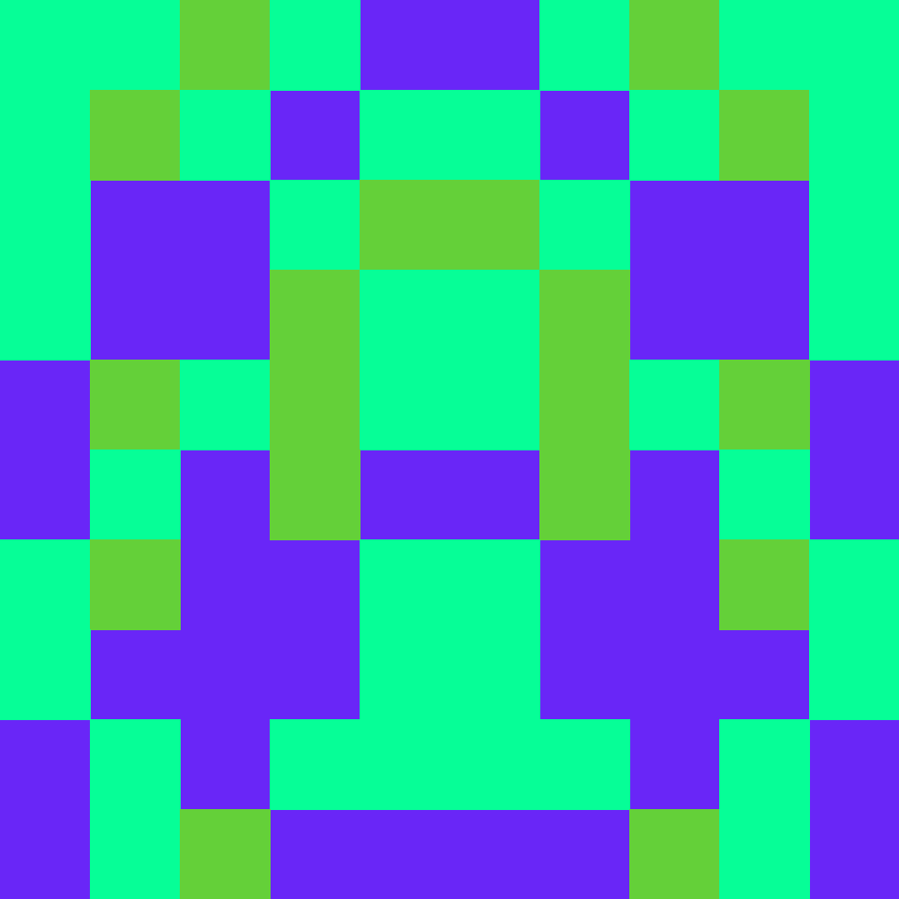
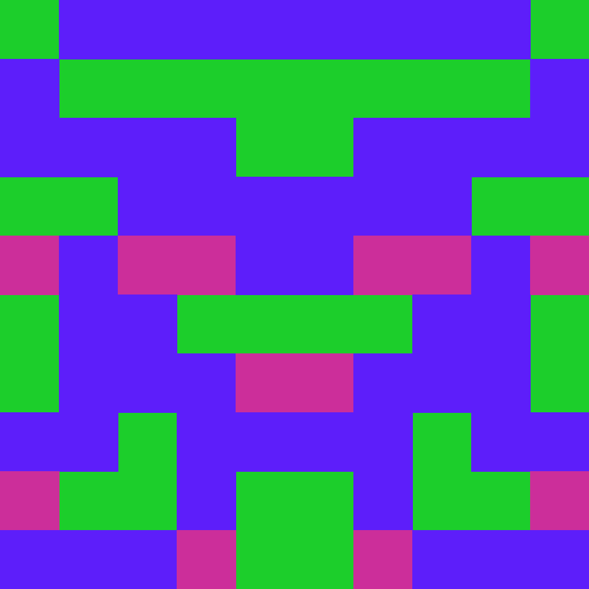
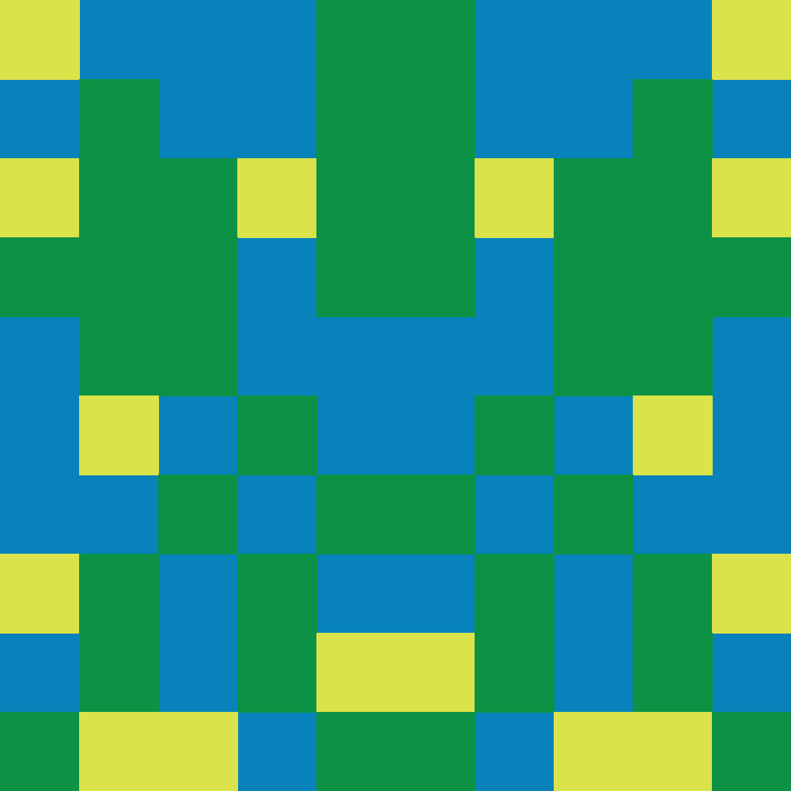

  List of Links

<html>
  <head>
    <meta charset="utf-8" />
    <meta name="viewport" content="width=device-width, initial-scale=1" />
    <meta http-equiv="content-type" content="text/html; charset=UTF-8">
    <meta http-equiv="onion-location" content="http://dqunl5rzlv6skqfklqr4dwi4zph2vqoaennc7qoinqs5mlug4docq2yd.onion"/>
    <meta name="robots" content="nofollow,noindex"/>
    <meta name="description" content="list of links for terminaldweller"/>
    <meta name="author" content="terminaldweller"/>
  </head>
  <body style="color:#005f87;background:#000000;text-align:center;padding:0px;border:0px;margin:0px;font-family:mono;border:solid;">
    <h2>LIST OF LINKS</h2>
    

      

      

        

          
        

      

      

       
      

        Timestamp: 1698948133
      

    

    

      
This page is available on:

      
<a href="https://terminaldweller.com">the clear webs</a> - https://terminaldweller.com

      
<a href="https://ipfs.terminaldweller.com">IPFS</a> - https://ipfs.terminaldweller.com or terminaldweller.eth<a href="https://www.ipfs.tech/" style="color: #005f00;text-decoration: none;font-weight: bold;" title="https://www.ipfs.tech/"> +</a>

      
<a href="gemini://gemini.terminaldweller.com">gemini</a> - gemini://gemini.terminaldweller.com<a href="https://gemini.circumlunar.space/" style="color: #005f00;text-decoration: none;font-weight: bold;" title="https://gemini.circumlunar.space/"> +</a>

      
<a href="http://iedzwh5v2vouywqy4eak3eu33amfn3rzhdcln7j4r5kcyvf46cea.b32.i2p/">i2p mirror</a> - http://iedzwh5v2vouywqy4eak3eu33amfn3rzhdcln7j4r5kcyvf46cea.b32.i2p

      
<a href="http://dqunl5rzlv6skqfklqr4dwi4zph2vqoaennc7qoinqs5mlug4docq2yd.onion/">tor mirror</a> - http://dqunl5rzlv6skqfklqr4dwi4zph2vqoaennc7qoinqs5mlug4docq2yd.onion

      
<a href="http://[21e:cd57:a147:322a:723b:a322:e4c8:c26e]/">yggdrasil</a> - http://[21e:cd57:a147:322a:723b:a322:e4c8:c26e]<a href="https://yggdrasil-network.github.io/" style="color: #005f00;text-decoration: none;font-weight: bold;" title="https://yggdrasil-network.github.io/"> +</a>

      
<a href="http://fyqzoraakwjwkj48cmp4ho8gy9k3hdk67stjb8z34d1u3p9urtgy.loki">lokinet</a> - http://fyqzoraakwjwkj48cmp4ho8gy9k3hdk67stjb8z34d1u3p9urtgy.loki

      
<a href="gopher://gopher.terminaldweller.com">gopher</a> - gopher://gopher.terminaldweller.com

    

    

      <h3>WKD <a class="plus" href="https://wiki.gnupg.org/WKD" style="color: #005f00;text-decoration: none;" title="https://wiki.gnupg.org/WKD">+</a></h3>
      
WKD direct and advanced are set up on/for the domain.

    

    

      <h3>OpenAlias <a href="https://openalias.org/" style="color: #005f00;text-decoration: none;" title="https://openalias.org/">+</a></h3>
      
OpenAlias records are set for the domain.

    

    

      <h3>Keyoxide <a href="https://keyoxide.org/" style="color: #005f00;text-decoration: none" title="https://keyoxide.org/">+</a></h3>
      
<a href="https://keyoxide.org/hkp/9e20464f1ccf3b103249fa93a6a0f5158b3881df">keyoxide</a> - https://keyoxide.org/hkp/9e20464f1ccf3b103249fa93a6a0f5158b3881df

      
<a href="https://discover.terminaldweller.com">discover.terminaldweller.com</a> - https://discover.terminaldweller.com

      
I don't use all the accounts listed on the PGP pubkey regularly. The preferred methods of contacting me are the ones that are listed here, IRC, email and XMPP (The order is not significant).

       
      
Proofs that are expected to fail:

      <ul style="display: table;margin: 0 auto;">
        <li>IRC OFTC</li>
        <li>IRC Rizon</li>
        <li>IRC Tilde</li>
        <li>Opencollective</li>
        <li>Twitter of course</li>
      </ul>
    

    

      

        <h3>PGP Key: devi@terminaldweller.com</h3>
        
PGP FP: 9E20464F1CCF3B103249FA93A6A0F5158B3881DF

        
<a href="https://github.com/terminaldweller.gpg">github</a> - https://github.com/terminaldweller.gpg

        
<a href="https://gitlab.com/terminaldweller.gpg">gitlab</a> - https://gitlab.com/terminaldweller.gpg

        
<a href="https://codeberg.org/terminaldweller.gpg">codeberg</a> - https://codeberg.org/terminaldweller.gpg

        
<a href="keys/gpg_pubkey">self-hosted</a>

        
I manually upload the PGP key to <a href="https://keys.openpgp.org">https://keys.openpgp.org</a> and <a href="https://pgp.mit.edu/">https://pgp.mit.edu/</a> as well.

        
The PGP key you get from Codeberg will be a bit different since Codeberg requires you to sign a random string first before verifying your PGP public key.

         
        
I try to keep the key updated but due to keyoxide shenanigans, from time to time, the key might be missing some packets.

      

      

        <h3>SSH Key</h3>
        
SSH FP: SHA256:tyuaTy005jkJOIPXkrJAAlCKD91d1ftEXzGTqjmEZh4

        
<a href="https://github.com/terminaldweller.keys">github</a> - https://github.com/terminaldweller.keys

        
<a href="https://gitlab.com/terminaldweller.keys">gitlab</a> - https://gitlab.com/terminaldweller.keys

        
<a href="https://codeberg.org/terminaldweller.keys">codeberg</a> - https://codeberg.org/terminaldweller.keys

        
<a href="keys/id_rsa_pub">self-hosted</a>

      

      

        <h3>PGP key: thabogre@gmail.com</h3>
        
PGP FP: FB3E38C3D7C6C07C66A4E3AD4041446A786EBAB4

        
<a href="keys/gmail_gpg_pubkey">self-hosted</a>

        
I manually upload the PGP key to <a href="https://keys.openpgp.org">https://keys.openpgp.org</a> and <a href="https://pgp.mit.edu/">https://pgp.mit.edu/</a> as well.

      

      

        <h3>PGP key: bloodstalker@zoho.com</h3>
        
PGP FP: 1501CFE6C731BA61BE6BC065F4241FB7ACBB40E1

        
<a href="keys/zoho_gpg_pubkey">self-hosted</a>

        
I manually upload the PGP key to <a href="https://keys.openpgp.org">https://keys.openpgp.org</a> and <a href="https://pgp.mit.edu/">https://pgp.mit.edu/</a> as well.

      

      

        <h3>PGP key: farzadsadeghi@protonmail.ch</h3>
        
PGP FP: 3ba4099f7fa54321f2c8529b546d1c2bd3b3f32a

        
<a href="keys/proton_pubkey">self-hosted</a>

        
Or you can download directly from <a href="https://mail-api.proton.me/pks/lookup?op=get&search=farzadsadeghi@protonmail.ch">proton</a>: https://mail-api.proton.me/pks/lookup?op=get&search=farzadsadeghi@protonmail.ch

      

      

        <h3>IRC</h3>
        
<a href="https://libera.chat">Libera.Chat</a>: terminaldweller FP: FEF763019F0799C1B5CD190FC89080240665CDCAE1CB889D4413775447A4826F48B18DC134D3ACDDE1D932CF3280E6026099857CF46177F1D87CD9AA859C615F

        
<a href="https://oftc.net/">OFTC</a>: terminaldweller FP: 1072EFECA623C6E3D7A6628BEB6021F77EA2C876

        
<a href="https://rizon.net/">rizon</a>: terminaldweller FP: 1072EFECA623C6E3D7A6628BEB6021F77EA2C876

        
<a href="https://tilde.chat/">tilde.chat</a>: terminaldweller FP: 1072EFECA623C6E3D7A6628BEB6021F77EA2C876

        
<a href="https://bnet.eu.org/">BonoboNET</a>: terminaldweller FP: 5e3bd8ab6f8c6f6a614d4b2245fd6b5737a6e59917c6719de62b55bac77b978c

        
<a href="https://hackint.org/">hackint</a>: terminaldweller FP: 5e3bd8ab6f8c6f6a614d4b2245fd6b5737a6e59917c6719de62b55bac77b978c

        
You can also find me on Libera, OFTC and Rizon in ##terminaldweller.

         
        <h4 style="margin: 0px;padding: 0px;">OTR <a href="https://otr.cypherpunks.ca/" style="color: #005f00;text-decoration: none;font-weight: bold;" title="https://otr.cypherpunks.ca/">+</a></h4>
        
<a href="https://libera.chat">Libera.Chat</a>: OTR FP: 7C919CDF 8E5E6546 0FC2F670 7F51458C 458AE9BE | 7C919CDF8E5E65460FC2F6707F51458C458AE9BE

        
<a href="https://oftc.net/">OFTC</a>: OTR FP: AEA731CA F51E6AA8 72AB5123 AE8A90EA B823AB2C | AEA731CAF51E6AA872AB5123AE8A90EAB823AB2C

        
<a href="https://rizon.net/">rizon</a>: OTR FP: 957129CA 0FB85F8E 5703AF0D 12313BBB 3BF8822B | 957129CA0FB85F8E5703AF0D12313BBB3BF8822B

        
<a href="https://tilde.chat/">tilde.chat</a>: OTR FP: 8C220E07 A3D5E103 B57B68CE 40B7D6F9 1A631A75 | 8C220E07A3D5E103B57B68CE40B7D6F91A631A75

        
<a href="https://bnet.eu.org/">BonoboNET</a>: OTR FP: B6C3FF85 0C2DA87F FE451366 0CDE443E DB8EED0C | B6C3FF850C2DA87FFE4513660CDE443EDB8EED0C

        
<a href="https://hackint.org/">hackint</a>: OTR FP: 255C19B2 B3D34328 E0C9FD80 62A841B4 416B55AC | 255C19B2B3D34328E0C9FD8062A841B4416B55AC

      

    

    

      <h3>XMPP <a href="https://xmpp.org/" style="color: #005f00;text-decoration: none;font-weight: bold;" title="https://xmpp.org/">+</a></h3>
      
devi@jabber.terminaldweller.com

      
devi@draugr.de

    

    

      <h3>Email</h3>
      
(the order is significant)

      
devi@terminaldweller.com

      
thabogre@gmail.com

      
bloodstalker@zoho.com

      
farzadsadeghi@protonmail.ch

       
      
All emails have the ssh and pgp key fingerprints as signature. You can ask for one.

      
For emails, I have adopted a "polite" policy. I sign all emails, unless I receive an encrypted email in which case, I will also encrypt the response.

    

    

      <h3>Matrix <a href="https://matrix.org/" style="color: #005f00;text-decoration: none;font-weight: bold;" title="https://matrix.org/">+</a></h3>
      
<a href="https://matrix.to/#/@devi:terminaldweller.com">@devi:terminaldweller.com</a> - @devi:terminaldweller.com - https://matrix.to/#/@devi:terminaldweller.com

      
I'm using webfinger for the matrix ID. My actual matrix ID is @devi:matrix.terminaldweller.com.

       
      
<a href="https://matrix.to/#/@terminaldweller:matrix.org">@terminaldweller:matrix.org</a> - @terminaldweller:matrix.org - https://matrix.to/#/@terminaldweller:matrix.org

    

    

      <h3>OpenID <a href="https://openid.net/" style="color: #005f00;text-decoration: none;font-weight: bold;" title="https://openid.net/">+</a></h3>
      
OpenID: <a href="https://launchpad.net/~terminaldweller">https://launchpad.net/~terminaldweller</a> - https://launchpad.net/~terminaldweller

    

    

      <h3>Git</h3>
      
<a href="https://github.com/terminaldweller">github.com/terminaldweller</a> - https://github.com/terminaldweller

      
Mirrors:

      
<a href="https://git.terminaldweller.com">git.terminaldweller.com</a> - https://git.terminaldweller.com

      
<a href="https://codeberg.org/terminaldweller">codeberg.org/terminaldweller</a> - https://codeberg.org/terminaldweller

      
<a href="https://gitlab.com/terminaldweller">gitlab.com/terminaldweller</a> - https://gitlab.com/terminaldweller

    

    

      <h3>Hugging Face</h3>
      
<a href="https://huggingface.co/terminaldweller">huggingface.co/terminaldweller</a> - https://huggingface.co/terminaldweller

    

    

      <h3>Kaggle</h3>
      
<a href="https://www.kaggle.com/terminaldweller">kaggle.com/terminaldweller</a> - https://www.kaggle.com/terminaldweller

    

    

      <h3>ActivityPub <a href="https://www.w3.org/TR/activitypub/" style="color: #005f00;text-decoration: none;font-weight: bold;" title="https://www.w3.org/TR/activitypub/">+</a></h3>
      
<a href="https://pleroma.terminaldweller.com/users/devi">@devi@terminaldweller.com</a> - @devi@terminaldweller.com - https://pleroma.terminaldweller.com/users/devi

      
I'm using webfinger for the pleroma ID. My actual pleroma ID is @devi@pleroma.terminaldweller.com.

       
      
<a href="https://fosstodon.org/@terminaldweller">@terminaldweller@fosstodon.com</a> - @terminaldweller@fosstodon.com - https://fosstodon.org/@terminaldweller

    

    

      <h3>Nostr <a href="https://nostr.com/" style="color: #005f00;text-decoration: none;font-weight: bold;" title="https://nostr.com/">+</a></h3>
      
Public Key: hex:00000002e2b8fa65ed2fd15ab394243497d7c443c9eea5bea08d66db75f91eb1 bech32:npub1qqqqqqhzhraxtmf069dt89pyxjta03zre8h2t04q34ndka0er6cs94ucud

      
Nprofile: nprofile1qqsqqqqqqt3t37n9a5hazk4njsjrf97hc3punm49h6sg6ekmwhu3avgpzamhxue69uhkummnw3ezuer9dpjkjm3wdaexwtch70zsa

      
Payed relay: wss://nostr.dehein.org

    

    

      <h3>Blog</h3>
      
<a href="https://blog.terminaldweller.com">Blog</a> - https://blog.terminaldweller.com | <a href="https://blog.terminaldweller.com/rss/feed">RSS</a> - https://blog.terminaldweller.com/rss/feed

    

    

      <h3>Linkedin</h3>
      
<a href="https://www.linkedin.com/in/farzad-sadeghi/">Linkedin</a> - https://www.linkedin.com/in/farzad-sadeghi

    

    

      <h3>Blockie Canaries</h3>
        
Because it's easier to remember a picture with colors than a long random-looking string.

         
        

        

            
            
            
            
        

        

        

        

            
            
            
        

        

        

        

            
            
            
            
            
            
        

        

    

    

      <h3>Privacy Policy</h3>
      
I keep IP logs. If that is of concern to you, please use this website over the anonymizing networks it is available on (Tor,I2P,Lokinet).

    

    

      <h3>Services</h3>
      
<a href="https://pastebin.terminaldweller.com">PrivateBin</a>: https://pastebin.terminaldweller.com <a href="https://github.com/PrivateBin/PrivateBin" style="color: #005f00;text-decoration: none;font-weight: bold;" title="https://github.com/PrivateBin/PrivateBin">+</a>

      
<a href="https://rssgen.terminaldweller.com/">rss-bridge</a>: https://rssgen.terminaldweller.com <a href="https://github.com/RSS-Bridge/rss-bridge" style="color: #005f00;text-decoration: none;font-weight: bold;" title="https://github.com/RSS-Bridge/rss-bridge">+</a>

      
<a href="https://doh.terminaldweller.com/getnsrecord">DoH</a>: https://doh.terminaldweller.com/getnsrecord <a href="https://github.com/DNSCrypt/doh-server" style="color: #005f00;text-decoration: none;font-weight: bold;" title="https://github.com/DNSCrypt/doh-server">+</a>

      
<a href="https://searx.terminaldweller.com">searxng</a>: https://searx.terminaldweller.com <a href="https://github.com/searxng/searxng" style="color: #005f00;text-decoration: none;font-weight: bold;" title="https://github.com/searxng/searxng">+</a>

      
<a href="https://url.dehein.org">YOURLS</a>: https://url.dehein.org <a href="https://github.com/YOURLS/YOURLS" style="color: #005f00;text-decoration: none;font-weight: bold;" title="https://github.com/YOURLS/YOURLS">+</a>

      
<a href="https://librex.terminaldweller.com">librex</a>: https://librex.terminaldweller.com <a href="https://github.com/hnhx/librex" style="color: #005f00;text-decoration: none;font-weight: bold;" title="https://github.com/hnhx/librex">+</a>

      
<a href="wss://nostr.dehein.org">nostream</a>: wss://nostr.dehein.org <a href="https://github.com/Cameri/nostream" style="color: #005f00;text-decoration: none;font-weight: bold;" title="https://github.com/Cameri/nostream">+</a>

       
      
The services will be eventually hosted on other overlay/mesh networks as well.

    

    

    

      
       
       
      
https://www.eff.org/

    

    

     
    

    <svg
      xmlns:xlink="http://www.w3.org/1999/xlink"
      xmlns="http://www.w3.org/2000/svg"
      width="396"
      height="174.97422800295186"
      viewBox="0 0 349.99999999999994 154.64893889149783"
      class="css-1j8o68f"
    >
      <defs id="SvgjsDefs1013"></defs>
      <g
        id="SvgjsG1014"
        featurekey="symbolFeature-0"
        transform="matrix(26.590088704294097,0,0,26.590088704294097,109.19144490593142,-24.80855509406858)"
        fill="#00AF87"
      >
        <title xmlns="http://www.w3.org/2000/svg">Heavy Corps</title>
        <g xmlns="http://www.w3.org/2000/svg" fill="#00AF87">
          <polygon
            points="2.77 1.478 3.325 1.478 3.325 1.285 2.964 1.285 2.964 0.933 2.395 0.933 2.395 1.126 2.77 1.126 2.77 1.478"
            fill="#00AF87"
          ></polygon>
          <polygon
            points="2.396 1.93 2.59 1.93 2.59 1.361 2.237 1.361 2.237 1 2.044 1 2.044 1.555 2.396 1.555 2.396 1.93"
            fill="#00AF87"
          ></polygon>
          <polygon
            points="3.164 2.205 3.358 2.205 3.358 1.845 3.71 1.845 3.71 1.276 3.516 1.276 3.516 1.651 3.164 1.651 3.164 2.205"
            fill="#00AF87"
          ></polygon>
          <polygon
            points="2.763 2.059 2.413 2.059 2.403 2.498 2.597 2.502 2.603 2.253 2.957 2.253 2.957 1.684 2.763 1.684 2.763 2.059"
            fill="#00AF87"
          ></polygon>
          <polygon
            points="4.067 2.395 3.874 2.395 3.874 2.77 3.522 2.77 3.522 3.325 3.715 3.325 3.715 2.964 4.067 2.964 4.067 2.395"
            fill="#00AF87"
          ></polygon>
          <polygon
            points="3.513 2.396 3.07 2.396 3.07 2.59 3.707 2.59 3.707 2.237 4 2.237 4 2.044 3.513 2.044 3.513 2.396"
            fill="#00AF87"
          ></polygon>
          <polygon
            points="3.724 3.71 3.724 3.516 3.349 3.516 3.349 3.083 2.795 3.083 2.795 3.277 3.155 3.277 3.155 3.71 3.724 3.71"
            fill="#00AF87"
          ></polygon>
          <polygon
            points="2.747 2.503 2.747 2.942 3.316 2.942 3.316 2.748 2.941 2.748 2.941 2.503 2.747 2.503"
            fill="#00AF87"
          ></polygon>
          <polygon
            points="2.605 4.067 2.605 3.874 2.23 3.874 2.23 3.522 1.675 3.522 1.675 3.715 2.036 3.715 2.036 4.067 2.605 4.067"
            fill="#00AF87"
          ></polygon>
          <polygon
            points="2.956 4 2.956 3.445 2.604 3.445 2.604 3.07 2.41 3.07 2.41 3.639 2.763 3.639 2.763 4 2.956 4"
            fill="#00AF87"
          ></polygon>
          <polygon
            points="1.484 3.349 1.836 3.349 1.836 2.795 1.642 2.795 1.642 3.155 1.29 3.155 1.29 3.724 1.484 3.724 1.484 3.349"
            fill="#00AF87"
          ></polygon>
          <polygon
            points="2.043 3.316 2.237 3.316 2.237 2.876 2.6 2.876 2.6 2.682 2.043 2.682 2.043 3.316"
            fill="#00AF87"
          ></polygon>
          <polygon
            points="1.126 2.23 1.497 2.23 1.497 1.675 1.304 1.675 1.304 2.036 0.933 2.036 0.933 2.605 1.126 2.605 1.126 2.23"
            fill="#00AF87"
          ></polygon>
          <polygon
            points="1.304 2.763 1 2.763 1 2.956 1.497 2.956 1.497 2.604 1.93 2.604 1.93 2.41 1.304 2.41 1.304 2.763"
            fill="#00AF87"
          ></polygon>
          <polygon
            points="1.651 1.909 2.205 1.909 2.205 1.716 1.845 1.716 1.845 1.29 1.276 1.29 1.276 1.484 1.651 1.484 1.651 1.909"
            fill="#00AF87"
          ></polygon>
          <polygon
            points="1.684 2.237 2.059 2.237 2.059 2.492 2.253 2.492 2.253 2.043 1.684 2.043 1.684 2.237"
            fill="#00AF87"
          ></polygon>
        </g>
      </g>
      <g
        id="SvgjsG1015"
        featurekey="nameFeature-0"
        transform="matrix(0.7290755822805288,0,0,0.7290755822805288,-0.46660862296777517,94.28025600811284)"
        fill="#005F87"
      >
        <path
          d="M20.84 16.04 c-2.4 -2.52 -5.48 -4 -8.48 -4 l-11.72 0 l0 1.44 l11.72 0.04 c1.88 0 3.68 0.6 5.4 1.76 c3.36 2.36 5.6 6.6 5.6 10.72 c0 2.16 -0.48 4.16 -1.48 6.04 c-2 3.72 -6.04 6.44 -9.52 6.44 l-10.28 0 l0 -22.44 l9.96 0.04 c1.44 0 2.84 0.44 4.16 1.36 c2.68 1.8 4.44 5.24 4.44 8.56 c0 2.44 -1.04 4.96 -2.92 6.92 c-1.76 1.76 -3.88 2.88 -5.64 2.88 l-4.56 0 l0.04 -15.8 l-1.4 0 l-0.04 16.52 l0 0.72 l5.96 0 c2.2 0 4.76 -1.24 6.72 -3.32 c2.12 -2.28 3.28 -5.08 3.28 -7.92 c0 -2.88 -1.12 -5.76 -3.16 -8 c-2.2 -2.2 -4.6 -3.4 -6.88 -3.4 l-11.4 0 l0 25.36 l11.72 0 c2.88 0 6 -1.48 8.36 -4 c2.6 -2.68 4.04 -6.24 4.04 -9.96 s-1.36 -7.24 -3.92 -9.96 z M11.92 34.519999999999996 c1.12 0 2.28 -0.44 3.52 -1.28 c2.44 -1.72 4 -4.6 4 -7.28 c0 -1.44 -0.36 -2.84 -1.04 -4.2 c-1.4 -2.68 -3.92 -4.36 -6.48 -4.36 l-8.6 0.04 l0.04 19.88 l1.44 0 l0 -18.48 l7.12 -0.04 c0.92 0 1.88 0.36 2.88 1.04 c2.04 1.44 3.2 3.68 3.2 6.12 c0 1.64 -0.76 3.48 -2 4.88 s-2.76 2.24 -4.08 2.24 l-2.84 0 l0 1.44 l2.84 0 z M29.475 12.079999999999998 l1.44 0 l0 26.48 l15.32 0 l0 -4 l-11.28 0 l0 -3.84 l1.44 0 l0 2.4 l11.28 0 l0 6.88 l-18.2 0 l0 -27.92 z M32.195 12.079999999999998 l15.28 0 l0 6.84 l-9.6 0 l0 -1.44 l8.16 0 l0 -3.96 l-12.4 0 l0 11.56 l9.32 0 l0 1.44 l-10.76 0 l0 -14.44 z M32.195 27.8 l12.16 0 l0 -4 l-9.4 0 l0 -9.08 l9.68 0 l0 1.44 l-8.24 0 l0 6.2 l9.4 0 l0 6.88 l-12.16 0 l0 6.64 l11.2 0 l0 1.44 l-12.64 0 l0 -9.52 z M53.19 13.48 l4.52 0 l6.96 14.48 l0.84 -1.72 l-6.88 -14.24 l-7.8 0 l13.48 28 l0.68 0 l12.84 -26.52 l1.4 0 l-12.88 26.52 l1.64 0 l13.6 -28 l-4.68 0 l-12.24 25.2 z M64.71 34.44 l10.84 -22.44 l-1.68 0 l-9.16 19.04 l-7.88 -16.28 l-1.64 0 z M84.585 12 l4.2 0 l0 25.32 l-1.44 0 l0 -23.88 l-1.32 0 l0 25.12 l4.04 0 l0 -26.56 l1.44 0 l0 28 l-6.92 0 l0 -28 z M112.695 12 l6.96 0 l0 9.24 l-1.48 0 l0 -7.76 l-4.04 0 l0 25.04 l4.04 0 l0 -7.72 l1.48 0 l0 9.2 l-6.96 0 l0 -28 z M115.455 14.64 l1.44 0 l0 7.84 l12.2 0 l0 -10.48 l1.4 0 l0 11.88 l-15.04 0 l0 -9.24 z M134.775 13.48 l-1.36 0 l0 10.52 l-1.44 0 l0 -12 l4.2 0 l0 28 l-1.4 0 l0 -26.52 z M129.095 29.52 l-12.2 0 l0 8.04 l-1.48 0 l0 -9.52 l15.08 0 l0 10.48 l1.48 0 l0 -11.8 l-16.56 0 l0 -1.4 l18 0 l0 14.68 l-4.32 0 l0 -10.48 z M139.61 12.079999999999998 l1.44 0 l0 26.48 l15.32 0 l0 -4 l-11.28 0 l0 -3.84 l1.44 0 l0 2.4 l11.28 0 l0 6.88 l-18.2 0 l0 -27.92 z M142.33 12.079999999999998 l15.28 0 l0 6.84 l-9.6 0 l0 -1.44 l8.16 0 l0 -3.96 l-12.4 0 l0 11.56 l9.32 0 l0 1.44 l-10.76 0 l0 -14.44 z M142.33 27.8 l12.16 0 l0 -4 l-9.4 0 l0 -9.08 l9.68 0 l0 1.44 l-8.24 0 l0 6.2 l9.4 0 l0 6.88 l-12.16 0 l0 6.64 l11.2 0 l0 1.44 l-12.64 0 l0 -9.52 z M165.125 37.52 l1.76 0 l1.4 -3.36 l10.44 0.04 l2.56 5.8 l7.36 -0.04 l-12.6 -27.96 l-2.56 0 l-12.52 27.96 l7.8 0 l1.36 -3.2 l7.96 0 l-0.6 -1.36 l-8.24 0 l-1.28 3.16 l-4.76 0 l11.08 -25.2 l0.96 0 l11.12 25.2 l-4.24 0 l-2.56 -5.72 l-12.4 0 z M169.885 30.48 l4.88 -11.64 l8.2 18.64 l1.64 0 l-9.84 -21.92 l-7.2 16.16 l11.6 0 l-4.4 -9.72 l-3.04 7.32 l1.56 0 l1.48 -3.64 l2.2 4.8 l-7.08 0 z M185.16 13.48 l4.52 0 l6.96 14.48 l0.84 -1.72 l-6.88 -14.24 l-7.8 0 l13.48 28 l0.68 0 l12.84 -26.52 l1.4 0 l-12.88 26.52 l1.64 0 l13.6 -28 l-4.68 0 l-12.24 25.2 z M196.67999999999998 34.44 l10.84 -22.44 l-1.68 0 l-9.16 19.04 l-7.88 -16.28 l-1.64 0 z M229.15499999999997 37.44 l1.44 0 l-0.04 -11.64 l8.52 -12.36 l1.56 0 l-8.68 12.44 l0 12.68 l-4.12 0 l0.04 -12.68 l-9.72 -13.88 l-1.76 0 l9.96 14.32 l0 13.68 l7.04 0 l0 -13.68 l10 -14.32 l-5.04 0 l-9.2 13.32 l0 12.12 z M235.03499999999997 12 l-6.68 9.8 l-5.92 -8.36 l1.56 0 l4.48 6.32 l0.88 -1.28 l-4.6 -6.48 l-5.04 0 l7.96 11.32 l0.68 1.04 l8.44 -12.36 l-1.76 0 z M262.86499999999995 12 l4.2 0 l0 25.32 l-1.44 0 l0 -23.88 l-1.32 0 l0 25.12 l4.04 0 l0 -26.56 l1.44 0 l0 28 l-6.92 0 l0 -28 z M293.17999999999995 28.6 l-16.36 -16.6 l-2 0 l19.8 20.12 l0 -17.32 l-1.44 0 l0 13.8 z M291.85999999999996 25.4 l0 -12 l4.08 0 l0 25.16 l-0.68 0 l-0.16 -0.16 l-18.32 -18.56 l0 20.16 l4.2 0 l0 -11.8 l-1.48 -1.52 l0 11.88 l-1.28 0 l0 -15.2 l16.6 16.64 l2.56 0 l0 -28 l-6.96 0 l0 11.84 z M275.46 40 l0 -23.4 l19.16 19.44 l0 -2.12 l-20.56 -20.76 l0 26.84 l1.4 0 z M321.81499999999994 16.04 c-2.4 -2.52 -5.48 -4 -8.48 -4 l-11.72 0 l0 1.44 l11.72 0.04 c1.88 0 3.68 0.6 5.4 1.76 c3.36 2.36 5.6 6.6 5.6 10.72 c0 2.16 -0.48 4.16 -1.48 6.04 c-2 3.72 -6.04 6.44 -9.52 6.44 l-10.28 0 l0 -22.44 l9.96 0.04 c1.44 0 2.84 0.44 4.16 1.36 c2.68 1.8 4.44 5.24 4.44 8.56 c0 2.44 -1.04 4.96 -2.92 6.92 c-1.76 1.76 -3.88 2.88 -5.64 2.88 l-4.56 0 l0.04 -15.8 l-1.4 0 l-0.04 16.52 l0 0.72 l5.96 0 c2.2 0 4.76 -1.24 6.72 -3.32 c2.12 -2.28 3.28 -5.08 3.28 -7.92 c0 -2.88 -1.12 -5.76 -3.16 -8 c-2.2 -2.2 -4.6 -3.4 -6.88 -3.4 l-11.4 0 l0 25.36 l11.72 0 c2.88 0 6 -1.48 8.36 -4 c2.6 -2.68 4.04 -6.24 4.04 -9.96 s-1.36 -7.24 -3.92 -9.96 z M312.895 34.519999999999996 c1.12 0 2.28 -0.44 3.52 -1.28 c2.44 -1.72 4 -4.6 4 -7.28 c0 -1.44 -0.36 -2.84 -1.04 -4.2 c-1.4 -2.68 -3.92 -4.36 -6.48 -4.36 l-8.6 0.04 l0.04 19.88 l1.44 0 l0 -18.48 l7.12 -0.04 c0.92 0 1.88 0.36 2.88 1.04 c2.04 1.44 3.2 3.68 3.2 6.12 c0 1.64 -0.76 3.48 -2 4.88 s-2.76 2.24 -4.08 2.24 l-2.84 0 l0 1.44 l2.84 0 z M341.72999999999996 40 c-3.88 0 -6.84 -1 -8.8 -3 c-1.92 -1.92 -2.92 -4.76 -2.92 -8.12 l0 -16.84 l6.8 0 l0 16.84 c0 3.04 1.48 4.32 4.72 4.32 c3.16 0 4.88 -1.56 4.88 -4.32 l0 -16.84 l4.12 0 l0 16.84 c0 2.12 -0.56 4.12 -1.64 5.56 c-1.44 1.96 -3.72 2.88 -7.24 2.88 c-2.04 0 -3.68 -0.28 -4.92 -0.88 c-2.52 -1.16 -4.04 -3.76 -4.04 -7.56 l0 -14.28 l1.44 0 l0 14.28 c0 4.52 2.6 7 7.52 7 s7.44 -2.48 7.44 -7 l0 -15.4 l-1.24 0 l0 15.4 c0 3.52 -2.36 5.76 -6.32 5.76 c-4 0 -6.12 -2.04 -6.12 -5.76 l0 -15.4 l-3.96 0 l0 15.4 c0 6.36 3.52 9.68 10.28 9.68 c3.52 0 5.92 -0.84 7.56 -2.56 s2.52 -4.2 2.52 -7.12 l0 -16.84 l1.44 0 l0 16.84 c0 3.36 -1.04 6.16 -2.96 8.12 c-1.92 2 -4.76 3 -8.56 3 z M361.005 33.4 c1.96 0.88 3.68 1.32 5.12 1.32 c0.72 0 1.16 -0.04 1.36 -0.16 c0.92 -0.24 1.56 -0.76 1.96 -1.56 l0.04 -0.08 c0.2 -0.36 0.28 -0.8 0.28 -1.36 c0 -0.28 -0.08 -0.6 -0.24 -1 l-0.08 -0.16 c-0.52 -1.08 -1.68 -1.8 -3.8 -2.48 l-0.4 -0.12 l-0.12 -0.04 c-3.24 -0.96 -5.32 -2.48 -6.32 -4.6 c-0.4 -0.8 -0.6 -1.68 -0.6 -2.64 c0 -1 0.2 -1.96 0.6 -2.96 l0.08 -0.16 c0.92 -1.84 2.4 -3.04 4.36 -3.64 c1.4 -0.2 2.2 -0.32 2.4 -0.32 c2.72 0 5.88 1.12 9.44 3.32 l0.76 -1.24 c-3.88 -2.36 -7.24 -3.52 -10.16 -3.52 c-1.16 0 -2.12 0.12 -2.8 0.4 c-2.36 0.64 -4.12 2.08 -5.28 4.36 l-0.12 0.28 c-0.48 1.16 -0.72 2.32 -0.72 3.48 c0 1.24 0.24 2.32 0.72 3.28 c1.24 2.48 3.64 4.24 7.24 5.32 l0.48 0.16 c1.64 0.52 2.6 1.08 2.96 1.72 l0.04 0.08 c0.08 0.12 0.12 0.28 0.12 0.48 c0 0.36 -0.04 0.6 -0.16 0.8 c-0.28 0.64 -0.96 0.96 -2.04 0.96 c-1.72 0 -4.2 -0.88 -6.12 -2.12 l-0.6 -0.36 l-3.52 5.68 l0.6 0.36 c2.84 1.92 6.6 3.12 9.64 3.12 c1 0 1.92 -0.12 2.76 -0.36 c2.36 -0.68 4.12 -2.16 5.28 -4.4 l0.16 -0.28 c0.48 -1.24 0.72 -2.4 0.72 -3.48 c0 -0.96 -0.32 -2.16 -0.92 -3.64 c-1.08 -2.16 -3.36 -3.8 -6.92 -4.92 l-0.56 -0.16 c-1.12 -0.36 -1.88 -0.72 -2.24 -1 c-0.48 -0.4 -0.76 -0.68 -0.88 -0.84 l-0.08 -0.44 c0 -0.4 0.08 -0.76 0.28 -1.04 c0.32 -0.6 0.64 -0.76 1.92 -0.76 c1.72 0 4.2 0.88 6.12 2.12 l0.6 0.36 l2.16 -3.44 l-0.64 -0.36 c-2.44 -1.6 -5.76 -2.72 -8.2 -2.72 c-1.08 0 -1.76 0.08 -2.12 0.28 c-1.64 0.48 -2.88 1.52 -3.68 3.08 c-0.36 0.68 -0.52 1.48 -0.52 2.48 c0 0.76 0.16 1.48 0.48 2.16 c0.84 1.8 2.72 3.12 5.64 4 l0.52 0.16 l1.08 0.4 c0.6 0.24 1.24 0.56 1.96 0.96 c1.28 0.76 1.92 1.84 1.92 3.28 c0 0.8 -0.2 1.56 -0.56 2.24 c-0.84 1.48 -2.28 2.24 -4.28 2.24 c-1.36 0 -3.28 -0.52 -5.76 -1.52 l-0.68 1.16 l-0.04 0.08 c2.28 1.16 4.44 1.72 6.52 1.72 c1.16 0 2.24 -0.24 3.2 -0.72 c1.88 -0.92 3.04 -2.84 3.04 -5.24 c0 -3.8 -2.92 -4.92 -6 -6 l-0.52 -0.16 c-2.52 -0.76 -4.08 -1.8 -4.72 -3.2 c-0.24 -0.48 -0.36 -1 -0.36 -1.6 c0 -0.76 0.12 -1.36 0.4 -1.88 c0.64 -1.16 1.56 -1.92 2.76 -2.28 l1.6 -0.2 c2.12 0 4.44 0.72 6.96 2.12 l-0.64 1 c-2.6 -1.28 -4.68 -1.92 -6.2 -1.92 c-0.76 0 -1.2 0.04 -1.4 0.16 c-0.88 0.24 -1.52 0.76 -1.96 1.6 l-0.04 0.08 c-0.2 0.36 -0.28 0.84 -0.28 1.44 c0 0.44 0.08 0.76 0.2 0.96 c0.52 1.08 1.88 1.96 4.04 2.6 l0.52 0.16 l1 0.32 c0.12 0.04 0.76 0.32 1.92 0.88 c1.56 0.88 2.68 2 3.32 3.32 c0.4 0.8 0.6 1.68 0.6 2.64 c0 1.16 -0.2 2.16 -0.64 3 l-0.08 0.16 c-0.92 1.84 -2.4 3.04 -4.36 3.64 c-1.4 0.2 -2.2 0.32 -2.4 0.32 c-2.04 0 -4.68 -0.76 -7.12 -1.92 l-1.12 -0.6 l2 -3.24 z M387.96 17.2 l9.56 0 l0 -3.8 l-17 0 l0 1.24 l15.64 0 l0 1.44 l-17.08 0 l0 -4.12 l19.88 0 l0 6.68 l-9.56 0 l0 18.72 l-1.44 0 l0 -20.16 z M385.28 18.64 l-6.2 0 l0 -1.44 l7.64 0 l0 21.32 l4 0 l0 -18.64 l1.44 0 l0 20.12 l-6.88 0 l0 -21.36 z M402.675 12 l4.2 0 l0 25.32 l-1.44 0 l0 -23.88 l-1.32 0 l0 25.12 l4.04 0 l0 -26.56 l1.44 0 l0 28 l-6.92 0 l0 -28 z M434.55 38.56 l-4.6 0 l-5.52 -10.28 l-3.72 0.04 l0 10.24 l-4.04 0 l0 -26.56 l-1.44 0 l0 28 l6.96 0 l0 -10.28 l1.4 0 l5.48 10.28 l7.88 0 l-5.52 -10.32 l-1.32 0.52 z M425.03 13.440000000000001 c5.8 0 9.08 2.6 9.08 7.36 c0 4.32 -2.6 6.96 -7.12 7.44 l-1.08 0.12 l5 9.24 l1.64 0 l-4.36 -8.12 c4.8 -0.84 7.36 -3.76 7.36 -8.68 c0 -1.64 -0.36 -3.12 -1.04 -4.44 c-1.6 -2.84 -4.88 -4.36 -9.48 -4.36 l-7.08 0 l0 25.56 l1.44 0 l0 -24.12 l5.64 0 z M424.71 27.04 c5.48 0 8.08 -1.88 8.08 -6.04 c0 -3.96 -2.72 -6.2 -7.08 -6.2 l-5.04 0 l0 4.2 l4.6 0 c2.12 0 3.2 0.6 3.2 1.8 c0 1.4 -1.32 2.08 -4 2.08 l-2.32 0 l0 -2.48 l-1.48 0 l0 3.92 l3.8 0 c3.56 0 5.44 -1.24 5.44 -3.52 c0 -0.72 -0.16 -1.28 -0.52 -1.72 c-0.68 -1 -2.04 -1.48 -4.12 -1.48 l-3.12 0 l0 -1.36 l3.56 0 c3.56 0 5.64 1.72 5.64 4.76 c0 3.16 -2.12 4.64 -6.64 4.64 l-4 0 l0 1.4 l4 0 z M439.385 12.079999999999998 l1.44 0 l0 26.48 l15.32 0 l0 -4 l-11.28 0 l0 -3.84 l1.44 0 l0 2.4 l11.28 0 l0 6.88 l-18.2 0 l0 -27.92 z M442.105 12.079999999999998 l15.28 0 l0 6.84 l-9.6 0 l0 -1.44 l8.16 0 l0 -3.96 l-12.4 0 l0 11.56 l9.32 0 l0 1.44 l-10.76 0 l0 -14.44 z M442.105 27.8 l12.16 0 l0 -4 l-9.4 0 l0 -9.08 l9.68 0 l0 1.44 l-8.24 0 l0 6.2 l9.4 0 l0 6.88 l-12.16 0 l0 6.64 l11.2 0 l0 1.44 l-12.64 0 l0 -9.52 z M465.86 33.4 c1.96 0.88 3.68 1.32 5.12 1.32 c0.72 0 1.16 -0.04 1.36 -0.16 c0.92 -0.24 1.56 -0.76 1.96 -1.56 l0.04 -0.08 c0.2 -0.36 0.28 -0.8 0.28 -1.36 c0 -0.28 -0.08 -0.6 -0.24 -1 l-0.08 -0.16 c-0.52 -1.08 -1.68 -1.8 -3.8 -2.48 l-0.4 -0.12 l-0.12 -0.04 c-3.24 -0.96 -5.32 -2.48 -6.32 -4.6 c-0.4 -0.8 -0.6 -1.68 -0.6 -2.64 c0 -1 0.2 -1.96 0.6 -2.96 l0.08 -0.16 c0.92 -1.84 2.4 -3.04 4.36 -3.64 c1.4 -0.2 2.2 -0.32 2.4 -0.32 c2.72 0 5.88 1.12 9.44 3.32 l0.76 -1.24 c-3.88 -2.36 -7.24 -3.52 -10.16 -3.52 c-1.16 0 -2.12 0.12 -2.8 0.4 c-2.36 0.64 -4.12 2.08 -5.28 4.36 l-0.12 0.28 c-0.48 1.16 -0.72 2.32 -0.72 3.48 c0 1.24 0.24 2.32 0.72 3.28 c1.24 2.48 3.64 4.24 7.24 5.32 l0.48 0.16 c1.64 0.52 2.6 1.08 2.96 1.72 l0.04 0.08 c0.08 0.12 0.12 0.28 0.12 0.48 c0 0.36 -0.04 0.6 -0.16 0.8 c-0.28 0.64 -0.96 0.96 -2.04 0.96 c-1.72 0 -4.2 -0.88 -6.12 -2.12 l-0.6 -0.36 l-3.52 5.68 l0.6 0.36 c2.84 1.92 6.6 3.12 9.64 3.12 c1 0 1.92 -0.12 2.76 -0.36 c2.36 -0.68 4.12 -2.16 5.28 -4.4 l0.16 -0.28 c0.48 -1.24 0.72 -2.4 0.72 -3.48 c0 -0.96 -0.32 -2.16 -0.92 -3.64 c-1.08 -2.16 -3.36 -3.8 -6.92 -4.92 l-0.56 -0.16 c-1.12 -0.36 -1.88 -0.72 -2.24 -1 c-0.48 -0.4 -0.76 -0.68 -0.88 -0.84 l-0.08 -0.44 c0 -0.4 0.08 -0.76 0.28 -1.04 c0.32 -0.6 0.64 -0.76 1.92 -0.76 c1.72 0 4.2 0.88 6.12 2.12 l0.6 0.36 l2.16 -3.44 l-0.64 -0.36 c-2.44 -1.6 -5.76 -2.72 -8.2 -2.72 c-1.08 0 -1.76 0.08 -2.12 0.28 c-1.64 0.48 -2.88 1.52 -3.68 3.08 c-0.36 0.68 -0.52 1.48 -0.52 2.48 c0 0.76 0.16 1.48 0.48 2.16 c0.84 1.8 2.72 3.12 5.64 4 l0.52 0.16 l1.08 0.4 c0.6 0.24 1.24 0.56 1.96 0.96 c1.28 0.76 1.92 1.84 1.92 3.28 c0 0.8 -0.2 1.56 -0.56 2.24 c-0.84 1.48 -2.28 2.24 -4.28 2.24 c-1.36 0 -3.28 -0.52 -5.76 -1.52 l-0.68 1.16 l-0.04 0.08 c2.28 1.16 4.44 1.72 6.52 1.72 c1.16 0 2.24 -0.24 3.2 -0.72 c1.88 -0.92 3.04 -2.84 3.04 -5.24 c0 -3.8 -2.92 -4.92 -6 -6 l-0.52 -0.16 c-2.52 -0.76 -4.08 -1.8 -4.72 -3.2 c-0.24 -0.48 -0.36 -1 -0.36 -1.6 c0 -0.76 0.12 -1.36 0.4 -1.88 c0.64 -1.16 1.56 -1.92 2.76 -2.28 l1.6 -0.2 c2.12 0 4.44 0.72 6.96 2.12 l-0.64 1 c-2.6 -1.28 -4.68 -1.92 -6.2 -1.92 c-0.76 0 -1.2 0.04 -1.4 0.16 c-0.88 0.24 -1.52 0.76 -1.96 1.6 l-0.04 0.08 c-0.2 0.36 -0.28 0.84 -0.28 1.44 c0 0.44 0.08 0.76 0.2 0.96 c0.52 1.08 1.88 1.96 4.04 2.6 l0.52 0.16 l1 0.32 c0.12 0.04 0.76 0.32 1.92 0.88 c1.56 0.88 2.68 2 3.32 3.32 c0.4 0.8 0.6 1.68 0.6 2.64 c0 1.16 -0.2 2.16 -0.64 3 l-0.08 0.16 c-0.92 1.84 -2.4 3.04 -4.36 3.64 c-1.4 0.2 -2.2 0.32 -2.4 0.32 c-2.04 0 -4.68 -0.76 -7.12 -1.92 l-1.12 -0.6 l2 -3.24 z"
          fill="#005F87"
        ></path>
      </g>
      <g
        id="SvgjsG1016"
        featurekey="sloganFeature-0"
        transform="matrix(0.8032609810251841,0,0,0.8032609810251841,109.53284425020935,138.42683427576108)"
        fill="#00AF87"
      >
        <path
          d="M10.723 5.888999999999999 l2.9297 0 l0 14.111 l-2.9297 0 l0 -5.8008 l-5.9668 0 l0 5.8008 l-2.9297 0 l0 -14.111 l2.9297 0 l0 5.7617 l5.9668 0 l0 -5.7617 z M27.412343749999998 8.467 l-5.2344 0 l0 3.2031 l4.6387 0 l0 2.5488 l-4.6387 0 l0 3.1934 l5.2344 0 l0 2.5879 l-8.1836 0 l0 -14.111 l8.1836 0 l0 2.5781 z M41.797343749999996 20 l-1.0254 -2.9102 l-5.9277 0 l-1.0254 2.9102 l-2.998 0 l5.1953 -14.111 l3.584 0 l5.1953 14.111 l-2.998 0 z M35.70314375 14.6387 l4.209 0 l-2.0996 -5.9863 z M57.81271875 5.888999999999999 l3.1152 0 l-5.2148 14.111 l-3.2227 0 l-5.1855 -14.111 l3.1055 0 l3.7012 10.693 z M75.55653125 5.888999999999999 l-4.6387 7.3535 l0 6.7578 l-2.9395 0 l0 -6.6895 l-4.668 -7.4219 l3.2422 0 l2.8809 4.8047 l2.8906 -4.8047 l3.2324 0 z M92.832059375 20.19531 c-4.1504 0 -7.2168 -2.8223 -7.2168 -7.2559 s3.0664 -7.2461 7.2168 -7.2461 c3.1445 0 5.6641 1.6113 6.6699 4.2871 l-2.7344 0.99609 c-0.625 -1.6406 -2.1191 -2.5879 -3.9355 -2.5879 c-2.4316 0 -4.2969 1.6992 -4.2969 4.5508 s1.8652 4.5605 4.2969 4.5605 c1.8164 0 3.3105 -0.95703 3.9355 -2.5977 l2.7344 0.99609 c-1.0059 2.6758 -3.5254 4.2969 -6.6699 4.2969 z M110.078153125 20.19531 c-4.1504 0 -7.2168 -2.832 -7.2168 -7.2559 c0 -4.4336 3.0664 -7.2461 7.2168 -7.2461 c4.1406 0 7.207 2.8125 7.207 7.2461 c0 4.4238 -3.0664 7.2559 -7.207 7.2559 z M110.078153125 17.5098 c2.4316 0 4.2969 -1.709 4.2969 -4.5703 c0 -2.8516 -1.8652 -4.5508 -4.2969 -4.5508 s-4.2969 1.6992 -4.2969 4.5508 c0 2.8613 1.8652 4.5703 4.2969 4.5703 z M129.355425 20 l-3.6719 -6.2109 l-0.84961 0 l0 6.2109 l-2.9297 0 l0 -14.111 l5.1172 0 c3.1934 0 4.541 1.8848 4.541 4.2188 c0 1.8945 -1.0742 3.125 -2.9883 3.5352 l4.248 6.3574 l-3.4668 0 z M124.834025 8.32 l0 3.3691 l1.7285 0 c1.5625 0 2.1973 -0.66406 2.1973 -1.6797 c0 -1.0059 -0.63477 -1.6895 -2.1973 -1.6895 l-1.7285 0 z M142.763659375 5.888999999999999 c2.7637 0 4.4824 2.0508 4.4824 4.5605 c0 2.5684 -1.7188 4.4922 -4.4824 4.4922 l-2.9395 0 l0 5.0586 l-2.9297 0 l0 -14.111 l5.8691 0 z M142.275359375 12.4902 c1.4648 0 2.1484 -0.81055 2.1484 -2.0801 c0 -1.2207 -0.68359 -2.0703 -2.1484 -2.0703 l-2.4512 0 l0 4.1504 l2.4512 0 z M156.3183875 20.19531 c-3.0273 0 -5.3906 -1.4551 -5.8203 -4.1016 l3.0273 -0.69336 c0.19531 1.582 1.3574 2.4023 2.9102 2.4023 c1.1914 0 2.1387 -0.52734 2.1289 -1.7188 c-0.0097656 -1.3281 -1.5723 -1.748 -3.291 -2.2754 c-2.0703 -0.64453 -4.2871 -1.4063 -4.2871 -4.0039 c0 -2.627 2.1484 -4.1113 4.9805 -4.1113 c2.4805 0 4.9805 1.0059 5.5469 3.7109 l-2.832 0.70313 c-0.26367 -1.4063 -1.2109 -2.0215 -2.5391 -2.0215 c-1.1816 0 -2.1875 0.48828 -2.1875 1.6504 c0 1.084 1.3867 1.4453 2.9883 1.9238 c2.1289 0.64453 4.6484 1.4648 4.6484 4.2773 c0 2.998 -2.5098 4.2578 -5.2734 4.2578 z"
          fill="#00FFCA"
        ></path>
      </g>
    </svg>
    

     
     
    
<a href="https://dehein.org">DeviHeavyIndustries</a> : https://dehein.org

     
    <noscript>This webpage does not require javascript.</noscript>
  </body>
</html>

